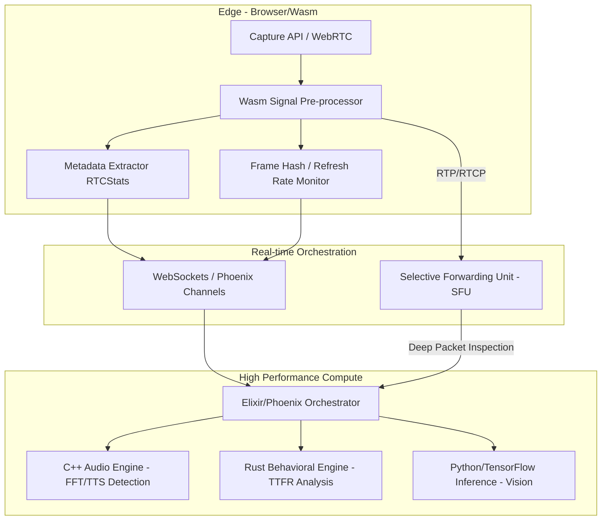

# AI-Assistance Detection System Architecture

## 1. Low-Level Architecture

El sistema está diseñado para operar con una latencia end-to-end < 200ms mediante un modelo de computación híbrida (Edge + Cloud).

### Componentes Core:
- **Edge Pre-processor (Wasm):** Ejecuta transformadas de Fourier rápidas (FFT) y hashing perceptual básico para reducir la carga de banda y latencia de inferencia inicial.
- **SFU Custom:** No solo retransmite, sino que intercepta metadatos RTCP para análisis de jitter y pérdida de paquetes que puedan enmascarar inyección de datos.
- **Orquestador (Elixir):** Maneja la concurrencia masiva mediante procesos ligeros de Erlang (BEAM), distribuyendo señales a los motores de inferencia especializados.

## 2. Ingesta de Señal y Edge Analysis

### Detección de Virtual Cameras y Virtual Audio Cables
La detección se basa en la discrepancia de capacidades de hardware y firmas de drivers expuestas vía WebRTC y APIs de enumeración:

1.  **RTCStatsReport Analysis:**
    -   **Jitter Buffer Fluctuation:** Los drivers virtuales (OBS-VirtualCam, VB-Audio) presentan patrones de jitter extremadamente bajos o artificialmente constantes, a diferencia del hardware físico que muestra ruido térmico y variaciones micro-temporales.
    -   **TotalSamplesDuration vs. Timestamp:** Desfases sistemáticos entre el `timestamp` del bloque de datos y la duración real de las muestras procesadas, indicando un pipeline de emulación/buffer intermedio.

2.  **Hardware Fingerprinting:**
    -   **MediaDevices Enumeration:** Monitoreo de `label` y `groupId`. Bloqueo de IDs que contienen strings conocidos (e.g., "Virtual", "CABLE", "Line 1", "OBS").
    -   **Device Capabilities Check:** Uso de `getSettings()` para verificar `frameRate` y `aspectRatio`. Las cámaras virtuales suelen fallar al reportar valores de exposición (exposureMode) o enfoque (focusMode) que el hardware real sí expone.

3.  **Wasm-side Heuristics:**
    -   Análisis de la latencia de inicialización del `MediaStreamTrack`. Los dispositivos virtuales responden significativamente más rápido (< 10ms) que el calentamiento físico de un sensor CMOS (50-200ms).

## 3. Análisis de Latencia Cognitiva (TTFR)

El microservicio de Behavioral Biometrics evalúa la probabilidad de asistencia externa analizando el **Time to First Response (TTFR)** en relación con la **Complejidad Semántica (SC)**.

### Algoritmo de Probabilidad de Respuesta:
1.  **Semantic Complexity Extraction:**
    -   Se procesa el audio de la pregunta del entrevistador vía Whisper-v3 (local inference).
    -   Se calcula un score de complejidad SC basado en: profundidad del árbol sintáctico, densidad de entidades técnicas y abstracción del prompt.
2.  **Expected Human Response Model (EHRM):**
    -   Base de datos de referencia que modela el tiempo de reacción humano promedio ($T_{base}$) para diferentes niveles de SC.
    -   $\mu_{expected} = T_{base} + \text{log}(SC) \times K$ (donde $K$ es la constante de latencia verbal).
3.  **TTFR Measurement:**
    -   Se mide el intervalo entre el fin del audio de la pregunta y el inicio de la modulación vocal del candidato ($VAD_{start}$).
    -   **Detección de Anomalía:** Si $TTFR < \mu_{expected} - 2\sigma$ (respuesta demasiado rápida para una pregunta compleja) o $TTFR > \mu_{expected} + \Delta_{LLM}$ (donde $\Delta_{LLM}$ es el overhead de procesamiento típico de GPT-4o), se incrementa el score de sospecha.

## 4. Procesamiento de Audio: Stutter & Echo Analysis

La inyección de audio vía Text-to-Speech (TTS) se detecta mediante el análisis de micro-anomalías en el dominio de la frecuencia y el tiempo.

### Firma Espectral y Micro-pausas:
1.  **Robotic Micro-stuttering:**
    -   Los motores TTS de baja latencia suelen generar artefactos de "jitter de síntesis" donde los fonemas se encadenan con una regularidad matemática antinatural.
    -   Se aplica una **STFT (Short-Time Fourier Transform)** para detectar la ausencia de variaciones de tono fundamentales ($f_0$) que son inherentes a la laringe humana (micro-vibraciones inestables).
2.  **Acoustic Fingerprinting:**
    -   **Noise Floor Analysis:** Las voces humanas tienen un ruido de fondo (respiración, ambiente) que desaparece o cambia abruptamente cuando se inyecta un stream digital puro.
    -   **Echo Cancellation (AEC) Artefacts:** Si el audio inyectado no pasa por el espacio físico, los algoritmos de AEC del navegador no detectarán el "leakage" esperado de la salida de audio hacia el micrófono, resultando en un `residualEchoLevel` inusualmente nulo en los `RTCStats`.
3.  **Pause Distribution:**
    -   Análisis de la distribución de pausas entre palabras. El habla humana sigue una distribución log-normal. El TTS tiende a ser lineal o rítmicamente perfecto.

## 5. Detección de Pantalla y Overlays

Identificamos herramientas de asistencia visual (e.g., ChatGPT overlays) mediante telemetría del DOM y análisis de frames.

### Estrategia de Monitoreo:
1.  **Refresh Rate Anomaly Detection:**
    -   El uso de overlays inyectados (via GPU/DirectX en aplicaciones desktop o via Browser extensions) causa micro-caídas en el frame rate reportado por `requestAnimationFrame`.
    -   Se monitorea la varianza en el `framesEncoded` de `RTCOutboundRTPStreamStats`. Un outlier en el delta de codificación indica la composición de una capa de UI externa sobre el stream de video.
2.  **Focus/Blur Heuristics:**
    -   **Lógica de Penalización:** No se basa en un evento `blur` aislado. Se implementa un contador de "Fuga de Foco Activa" (Active Focus Leak).
    -   Si el `blur` ocurre simultáneamente con una ráfaga de tráfico entrante detectada en los buffers de red del navegador, se infiere una consulta a una IA externa.
3.  **Visible Area Analysis:**
    -   Uso de `IntersectionObserver` y `Page Visibility API` para detectar si la ventana del examen es desplazada o parcialmente cubierta.
    -   **Heurística de Penalización:** $P_{score} = \sum (\text{duration\_blur} \times \text{semantic\_complexity\_at\_time\_t})$. Perder el foco durante una pregunta compleja es 5x más sospechoso que hacerlo durante una presentación.

## 6. Data Flow y Deep Packet Inspection (DPI)

El flujo de paquetes RTP/RTCP se analiza en tiempo real para detectar exfiltración de datos hacia motores de IA.

### Ruta del Paquete y Puntos de Inspección:
1.  **Ingress (SFU):** Los paquetes RTP llegan desde el Edge. El SFU desencapsula el header para leer el `SequenceNumber` y `Timestamp`.
2.  **DPI Layer (eBPF/Kernel side):**
    -   Se implementa un hook de **eBPF** en el nodo de red para monitorear conexiones salientes simultáneas desde la IP del cliente.
    -   **Pattern Matching:** Se buscan firmas de tráfico TLS (Server Name Indication - SNI) dirigidas a dominios como `api.openai.com`, `anthropic.com` o `proxy` de telemetría conocidos.
    -   **Traffic Volumetry:** Si se detecta un pico de tráfico *outbound* (subida de texto/frames) seguido inmediatamente por un pico *inbound* (bajada de respuesta) durante el periodo de silencio del candidato, se marca como sospecha alta.
3.  **Encapsulación de Metadatos:** Los hallazgos del DPI se inyectan como extensiones de header RTP personalizadas (Header Extensions) para que el Inference Engine final tenga el contexto de red del paquete.

## 7. Tech Stack y Escalabilidad

### Tech Stack Seleccionado:
-   **Client Side:** WebAssembly (Wasm) compilado desde **Rust** para procesamiento de señales (FFT, Hashing) con acceso zero-copy a los buffers de audio/video.
-   **Orchestration Layer:** **Elixir/Phoenix** debido a su modelo de procesos ligeros (millones de procesos concurrentes con soft real-time guarantees). Ideal para manejar 10k+ sockets sin bloqueo.
-   **Real-time Processing Engine:** **C++20** con **SIMD (Single Instruction, Multiple Data)** para el motor de audio y análisis espectral.
-   **Inference Orchestrator:** **Rust** (actix-web) para servir modelos de ML con latencia ultra-baja y seguridad de memoria.
-   **ML Models:** TensorFlow Lite / ONNX Runtime para ejecución optimizada en CPU/GPU.

### Escalabilidad (10,000 Entrevistas Concurrentes):
1.  **Distributed SFU Cluster:** Escalado horizontal de nodos SFU (basados en Mediasoup o Janus) geolocalizados para minimizar el RTT (Round Trip Time).
2.  **Backpressure Strategy:** Elixir gestiona el backpressure mediante `GenStage`. Si un motor de inferencia (C++/Python) se satura, se priorizan los streams con mayor score de sospecha inicial, degradando el análisis de streams "limpios" a un muestreo probabilístico.
3.  **Zero-Copy Pipelines:** Uso de `SharedArrayBuffers` en el cliente y `Zero-copy` deserialization en el backend para evitar la sobrecarga de GC (Garbage Collection) y latencia de serialización JSON/Protobuf.
4.  **Edge Offloading:** El 60% del análisis inicial (detección de dispositivos virtuales y pre-procesamiento FFT) ocurre en el Wasm del cliente, enviando solo vectores de características (feature vectors) al servidor en lugar del stream raw si el ancho de banda es limitado.
