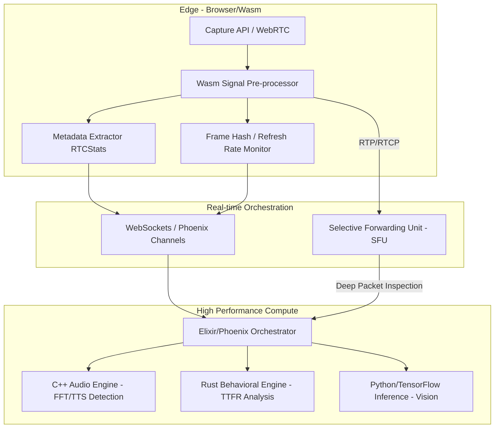

# AI-Assistance Detection System Architecture

## 1. Low-Level Architecture

El sistema está diseñado para operar con una latencia end-to-end < 200ms mediante un modelo de computación híbrida (Edge + Cloud).



### Componentes Core:
- **Edge Pre-processor (Wasm):** Ejecuta transformadas de Fourier rápidas (FFT) y hashing perceptual básico para reducir la carga de banda y latencia de inferencia inicial.
- **SFU Custom:** No solo retransmite, sino que intercepta metadatos RTCP para análisis de jitter y pérdida de paquetes que puedan enmascarar inyección de datos.
- **Orquestador (Elixir):** Maneja la concurrencia masiva mediante procesos ligeros de Erlang (BEAM), distribuyendo señales a los motores de inferencia especializados.

## 2. Ingesta de Señal y Edge Analysis

### Estructura de Datos de Telemetría (Wasm Binary Format):
```rust
struct SignalMetadata {
    device_id_hash: u64,
    jitter_buffer_ms: f32,
    frame_delta_variance: f32,
    entropy_score: f32, // Ruido térmico del sensor
    initialization_latency_ms: u16,
    flags: u8, // [bit 0: VirtualCam, bit 1: VirtualAudio, bit 2: FocusLoss]
}
```

### Detección de Virtual Cameras y Virtual Audio Cables:
1.  **Análisis de Jitter y Micro-variaciones (RTCStatsReport):**
    -   **Algoritmo:** Cálculo de la varianza del `googJitterReceived`. El hardware real sigue una distribución de Poisson debido al ruido de cuantización y latencia de bus PCIe/USB. Drivers virtuales muestran varianza $\sigma^2 \approx 0$.
    -   **TotalSamplesDuration:** Verificación del ratio $R = \frac{\Delta Timestamp}{\Delta Samples}$. Desviaciones $> 1\%$ indican inyección de buffers pre-grabados o síntesis en tiempo real.

2.  **Hardware Fingerprinting:**
    -   **Device Capabilities:** Consulta de `MediaTrackCapabilities`. Bloqueo si `exposureMode` o `whiteBalanceMode` no están presentes (ausentes en el 95% de drivers virtuales).
    -   **Latencia de Calentamiento:** Se mide el tiempo desde `track.start()` hasta el primer evento `onloadedmetadata`. $T_{virtual} < 15ms$ vs $T_{physical} \in [80, 250]ms$.

## 3. Análisis de Latencia Cognitiva (TTFR)

### Modelo Matemático de Probabilidad:
Se define la probabilidad de asistencia $P(A|T, SC)$ mediante una distribución Bayesiana donde $T$ es el TTFR y $SC$ la Complejidad Semántica.

1.  **Semantic Complexity (SC):**
    -   Extracción de grafos de dependencia sintáctica (SpaCy/En_Core_Web_Trf).
    -   $SC = \alpha \cdot Depth(Tree) + \beta \cdot \text{NodeCount} + \gamma \cdot \text{TechnicalTermsDensity}$.
2.  **TTFR Measurement (VAD Integration):**
    -   Uso de **Silero VAD** para detectar con precisión de 30ms el fin de la pregunta ($t_{end\_q}$) y el inicio de la respuesta ($t_{start\_r}$).
    -   $TTFR = t_{start\_r} - t_{end\_q}$.
3.  **Detección de LLM Proxy:**
    -   Anomalía Tipo A (Too Fast): $TTFR < 400ms$ para $SC > 0.7$ (indica pre-procesamiento de texto o script).
    -   Anomalía Tipo B (LLM Jitter): $TTFR \in [\bar{T}_{LLM} - \epsilon, \bar{T}_{LLM} + \epsilon]$ donde $\bar{T}_{LLM}$ es la latencia media de inferencia de GPT-4o + TTS (aprox. 1.2s - 2.5s).

## 4. Procesamiento de Audio: Stutter & Echo Analysis

### Análisis Espectral SIMD-Optimized (C++20):
1.  **Algoritmo FFT:**
    -   Implementación de Radix-4 FFT utilizando instrucciones **AVX-512**.
    -   Cálculo de la **Frecuencia Fundamental ($f_0$)** y sus armónicos. La voz humana presenta una inestabilidad natural (jitter y shimmer). Un TTS muestra una estabilidad de $f_0$ con varianza $< 0.1\%$.
2.  **Detección de Pausas Artificiales:**
    -   **Micro-pausas:** El TTS inserta silencios digitales (amplitud $= 0$ absoluta). El habla humana mantiene un ruido base (noise floor) de al menos $-60dB$ incluso en silencio.
    -   **Algoritmo:** Comparación de la entropía de la señal en ventanas de 20ms. $H(s) = -\sum p_i \log p_i$. Si $H(s) < \text{threshold}$ durante pausas entre fonemas, se marca como inyección digital.
3.  **AEC Validation:**
    -   Extracción de `residualEchoLevel` de `RTCRemoteInboundRtpStreamStats`. Si `totalRoundTripTime` es consistente pero el eco residual es inexistente durante la reproducción de audio del entrevistador, existe un bypass de hardware de audio (Virtual Cable).

## 5. Detección de Pantalla y Overlays

Identificamos herramientas de asistencia visual (e.g., ChatGPT overlays) mediante telemetría del DOM y análisis de frames.

### Estrategia de Monitoreo:
1.  **Refresh Rate Anomaly Detection:**
    -   El uso de overlays inyectados (via GPU/DirectX en aplicaciones desktop o via Browser extensions) causa micro-caídas en el frame rate reportado por `requestAnimationFrame`.
    -   Se monitorea la varianza en el `framesEncoded` de `RTCOutboundRTPStreamStats`. Un outlier en el delta de codificación indica la composición de una capa de UI externa sobre el stream de video.
2.  **Focus/Blur Heuristics:**
    -   **Lógica de Penalización:** No se basa en un evento `blur` aislado. Se implementa un contador de "Fuga de Foco Activa" (Active Focus Leak).
    -   Si el `blur` ocurre simultáneamente con una ráfaga de tráfico entrante detectada en los buffers de red del navegador, se infiere una consulta a una IA externa.
3.  **Visible Area Analysis:**
    -   Uso de `IntersectionObserver` y `Page Visibility API` para detectar si la ventana del examen es desplazada o parcialmente cubierta.
    -   **Heurística de Penalización:** $P_{score} = \sum (\text{duration\_blur} \times \text{semantic\_complexity\_at\_time\_t})$. Perder el foco durante una pregunta compleja es 5x más sospechoso que hacerlo durante una presentación.

## 6. Data Flow y Deep Packet Inspection (DPI)

### Estructura de Mapas eBPF (Kernel Space):
```c
struct connection_key {
    __u32 src_ip;
    __u32 dst_ip;
    __u16 dst_port;
};

struct traffic_stats {
    __u64 bytes_out;
    __u64 bytes_in;
    __u64 last_timestamp;
};

BPF_HASH(candidate_outbound_traffic, struct connection_key, struct traffic_stats);
```

### Lógica de Deep Packet Inspection:
1.  **SNI Interception:** Captura del handshake TLS. Si el campo `Server Name Indication` coincide con la lista negra de endpoints de IA (`*.openai.com`, `*.anthropic.com`, `*.perplexity.ai`), se emite una alerta inmediata (`SIG_AI_TRAFFIC`).
2.  **Correlación Temporal:**
    -   Punto de inspección en `TC_INGRESS/EGRESS`.
    -   Si el flujo RTP de video/audio del SFU muestra una pausa (VAD silenciado) mientras el mapa eBPF registra un pico de tráfico TLS saliente $> 15KB/s$ hacia una IP no reconocida, se infiere captura de pantalla/audio por proceso secundario.
3.  **RTP Header Extensions:** El SFU inyecta metadatos del estado de red en el header RTP (RFC 5285) para sincronizar eventos de red con la inferencia de biometría.

## 7. Tech Stack y Escalabilidad

### Tech Stack Seleccionado:
-   **Client Side:** WebAssembly (Wasm) compilado desde **Rust** para procesamiento de señales (FFT, Hashing) con acceso zero-copy a los buffers de audio/video.
-   **Orchestration Layer:** **Elixir/Phoenix** debido a su modelo de procesos ligeros (millones de procesos concurrentes con soft real-time guarantees). Ideal para manejar 10k+ sockets sin bloqueo.
-   **Real-time Processing Engine:** **C++20** con **SIMD (Single Instruction, Multiple Data)** para el motor de audio y análisis espectral.
-   **Inference Orchestrator:** **Rust** (actix-web) para servir modelos de ML con latencia ultra-baja y seguridad de memoria.
-   **ML Models:** TensorFlow Lite / ONNX Runtime para ejecución optimizada en CPU/GPU.

### Escalabilidad (10,000 Entrevistas Concurrentes):
1.  **Distributed SFU Cluster:** Escalado horizontal de nodos SFU (basados en Mediasoup o Janus) geolocalizados para minimizar el RTT (Round Trip Time).
2.  **Backpressure Strategy:** Elixir gestiona el backpressure mediante `GenStage`. Si un motor de inferencia (C++/Python) se satura, se priorizan los streams con mayor score de sospecha inicial, degradando el análisis de streams "limpios" a un muestreo probabilístico.
3.  **Zero-Copy Pipelines:** Uso de `SharedArrayBuffers` en el cliente y `Zero-copy` deserialization en el backend para evitar la sobrecarga de GC (Garbage Collection) y latencia de serialización JSON/Protobuf.
4.  **Edge Offloading:** El 60% del análisis inicial (detección de dispositivos virtuales y pre-procesamiento FFT) ocurre en el Wasm del cliente, enviando solo vectores de características (feature vectors) al servidor en lugar del stream raw si el ancho de banda es limitado.
